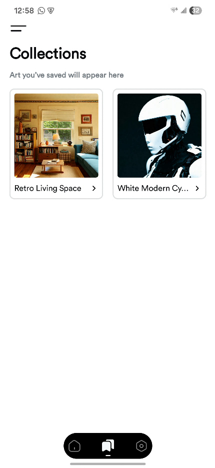

# AVATAR 🎨🤖

AVATAR is an **AI-powered Android app** built with **Jetpack Compose** that generates images from text prompts.  
It leverages **Hugging Face image generation models** and provides a clean, minimalist UI experience.

---

## ✨ Features
- 🖌️ Generate images from text prompts using AI  
- 📂 Option to upload an image and generate variations  
- 🎨 Minimalist UI with **Jetpack Compose**  
- 🌗 Dynamic icon that adapts to light/dark theme  
- ⚡ Built with modern Android tools:  
  - Kotlin  
  - Jetpack Compose  
  - Retrofit for API calls  
  - Coroutines & Flow for async tasks  

---

## 📱 Screenshots




---

## 🚀 Getting Started

### Prerequisites
- Android Studio **Giraffe+**
- JDK **17+**
- Android device/emulator (API 26+)

### Clone the repo
```bash
git clone https://github.com/<thobbiz>/avatar.git
cd avatar
